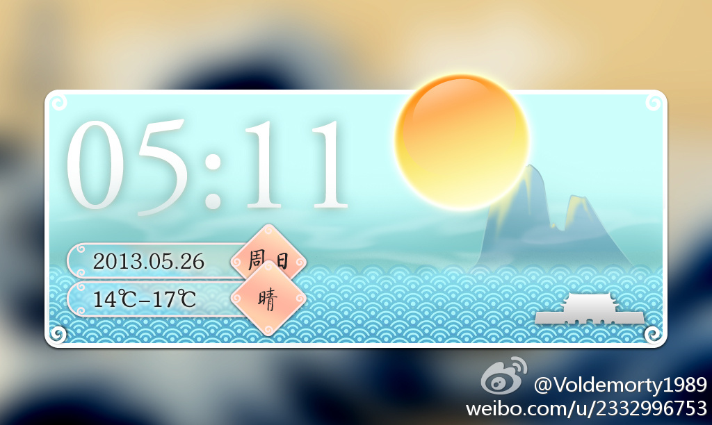
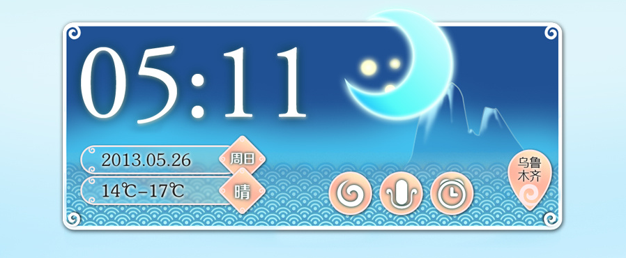
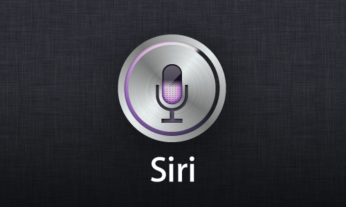
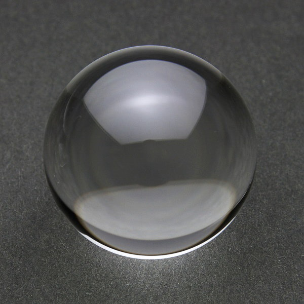
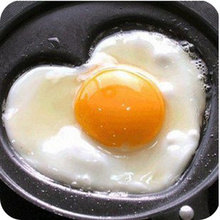
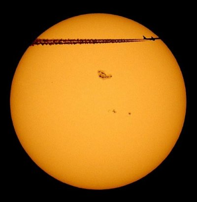
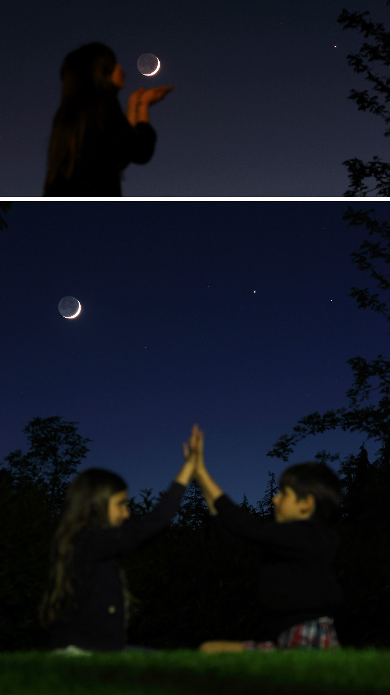
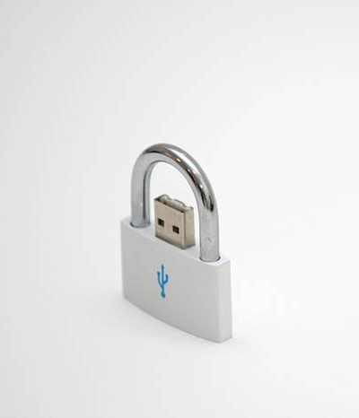

设计中的常识
===========

几日前，[@Voldemorty1989](http://weibo.com/2332996753 "他的微博") 同学在 [微博](http://weibo.com/2332996753/zvkYjclql "微博原文") 分享了自己的作品，请求大家指导：

我给他品论：
>太阳木有高亮，又不是水晶球。

@Voldemorty1989 同学很快修改了这处错误。由此，我又想到了许多同学会在月牙的缺口处画上几颗星星，这也是一个严重的错误。

今天，@Voldemorty1989 同学把整套 [设计作品](http://weibo.com/2332996753/zwEbSzeO4 "微博原文") 分享出来，果然把月牙的缺口画上了星星：

作为一个挑剔的人，我觉得必须要写写文章了。

设计中的现实成分
--------------

设计（Design）应该包括 现实 和 创意 两种成分。而创意，也有相当一部分是抽象自现实。

了解设计风格及其变化和发展的同学应该知道，最近有两种风格颇为流行：

__拟物：__ 模仿现实中物体的形状、色彩和纹理。比如 iOS 的设计，以及许多同学在画的 icon。

__扁平：__ 简化效果，剥离模仿现实的成分（阴影、高光、纹理）。比如 Android 和 Windows Phone 的设计。

这两种风格虽然完全不同，但都是基于现实的事物延伸和抽象而来。所以， __现实是设计的基础__  。

设计中背离现实的错误
------------------

下面几个是我在近几天看到的，在设计中背离现实的错误，分享出来与大家一同学习。

###1.太阳

太阳是经常出现在设计作品中的元素，比如天气图标等。文章开头提到的例子中，设计师给太阳加了高光，看起来更像是水晶球或煎蛋。

太阳看起来应该是这样（透过望远镜并减光）：

###2.月亮

月亮，准确的说法应该是 月球。月亮虽然有圆缺，但它本身还是一个球，并没有缺口，阴暗的部分是因为没有阳光直射（就像地球的黑夜一侧）。所以， __月牙的缺口中无法看到任何星星__ 。

来看一张月牙的照片，这张照片进行了长时间曝光，所以我们能清楚地看到月球的阴暗面：

###3.锁

[@song_楚歌飞雪](http://weibo.com/cathysong "他的微博") 同学也在前两天分享了自己的 [作品](http://weibo.com/1653923503/zvcPmozSr "微博原文")：

一个不太起眼，却又非常明显的错误：锁扣不会在锁的中心。

要善于观察
---------

善于观察，可以积累知识、获得灵感，从而提升设计的质量。许多常识，要从细致的观察得到。

我觉得设计师们都应该去搞搞摄影和手工制作，光熟悉 PS 的工具条是不够的， __现实才是设计的基础__  。

>关于我：  
>[LearnShare](http://weibo.com/learnshare "我的微博")，学 PS 起家的 Web 前端开发，业余天文爱好者，爱挑毛病星人。